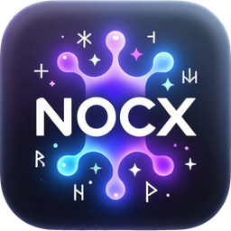

# nocx

A local-first terminal with GPU-accelerated rendering and a built-in SSH
manager. No account, no cloud service of its own, no product telemetry — the
network it touches is the network you point it at.

**[shady2k.github.io/nocx](https://shady2k.github.io/nocx/)** — what it does, and how to install it.

**Stack:** Go backend (PTY, SSH, session, transport) + xterm.js (WebGL) frontend +
Wails v3 desktop shell, connected over one WebSocket carrying a raw binary data
plane and a JSON-RPC 2.0 control plane.

**Status:** `v0.3.0`, early release, no formal support. macOS (universal) and
Linux (x86_64 AppImage). Tabs and workspaces, session restore, the sidebar
(Files, Git, Ports, Notes, Operations), encrypted command history, the vault,
snippets, file transfer between machines, an API client, and an assistant that
runs things all ship — see
[the v0.3.0 notes](docs/release-notes/v0.3.0.md) for what each one does, and
[the v0.2.0 notes](docs/release-notes/v0.2.0.md) for what came before.

> An earlier version of this line said SSH, tabs and cwd were "under active
> development" long after they shipped. It is named rather than quietly
> replaced because a status line is the one part of a README a reader trusts
> without checking, and this one was wrong for two releases.

## What makes it different

Flawless rendering of modern agent TUIs (Claude Code, aider, …) is table-stakes;
the wedge is the _combination_, all local in one app: Ghostty-grade rendering,
an integrated SSH manager, a secrets vault that leaves a reference in the
command instead of the value, command blocks with completions and a real
editor at the prompt, an API client whose collections are files in a folder you
own, and an assistant that acts inside the same scrollback — without an account
or a cloud service of ours.

Everything in that list ships as of `v0.3.0`; the vault, the blocks and the
completions carried a "(later)" here for two releases after they landed.

## Install (macOS)

Released builds are on the [Releases page](https://github.com/shady2k/nocx/releases). Download the `.dmg`, open it, and drag **nocx** into Applications.

There is no Apple Developer ID, so the build is ad-hoc signed rather than signed by an identity Apple can attest, and it is not notarized — macOS quarantines it on download. Clear that once, on first install:

```bash
xattr -dr com.apple.quarantine /Applications/nocx.app
```

Then open nocx normally. This is required only the first time — later in-app updates fetch the build directly and do not re-quarantine it. Confirm the version any time with `nocx --version`.

> No publisher signature and no notarization; the reasoning is in [ADR-0003](docs/decisions/0003-distribution-without-a-developer-id.md). Update integrity is enforced by an ed25519-signed manifest, not by Gatekeeper.

## Install (Linux)

Download the `.AppImage` from the [Releases page](https://github.com/shady2k/nocx/releases), make it executable, and run it:

```bash
chmod +x nocx-*-linux-amd64.AppImage
./nocx-*-linux-amd64.AppImage
```

No package manager or root access needed — the AppImage is a single self-contained file. In-app updates replace it in place (see [ADR-0007](docs/decisions/0007-cross-platform-auto-update.md)).

### Support envelope

The AppImage carries its own GTK 3 and WebKitGTK — the library **and** WebKitGTK's
helper processes, which is what lets it run where the host has no
`libwebkit2gtk-4.1` at all, and not only on Debian-shaped filesystems
([ADR-0035](docs/decisions/0035-appimage-carries-webkits-helper-processes.md)).
It links against **glibc 2.35** (the floor set by building on ubuntu-22.04).

It is self-contained in its **application** stack, not independent of a Linux
desktop: fonts and text shaping come from the host, deliberately, so that text
renders in your fonts rather than ours. In practice that means `fontconfig`,
`freetype`, `fribidi` and `harfbuzz` — present on every desktop install, absent
in a bare container, where the app will not start.

**This means it runs on distributions at or above that baseline**, including
Ubuntu 22.04+, Debian 12+, Fedora 39+, RHEL 9+, and Arch (rolling). It is
**not** "runs everywhere" — older enterprise distributions (RHEL 8, Ubuntu 20.04)
carry an earlier glibc and are not supported. If the AppImage refuses to start
and `ldd --version` reports a glibc before 2.35, the distribution is below the
floor.

> If the `APPIMAGE` environment variable is not set at runtime (e.g. you
> extracted the AppImage or installed via a package manager), in-app updates are
> silently disabled — the updater only engages when the app is running as an
> AppImage, mirroring the macOS refusals for dev and translocated builds
> ([ADR-0007](docs/decisions/0007-cross-platform-auto-update.md) §Decision).

## Rollback procedures

If an update fails or you need to return to the previous version, these
manual recovery paths cover both states an update can be in (§7.5 of the
distribution-and-updates design).

### After a successful update (to the retained known-good backup)

The previous version is saved as `.nocx-backup.app` (macOS) or
`.nocx-backup.AppImage` (Linux) next to the active bundle.

**macOS:**

```bash
osascript -e 'quit app "nocx"'
rm -rf /Applications/nocx.app
mv /Applications/.nocx-backup.app /Applications/nocx.app
```

**Linux:**

```bash
killall nocx
mv ~/.local/bin/.nocx-backup.AppImage ~/.local/bin/nocx.AppImage
```

### During a failed update (before health was ever confirmed)

If nocx was restarted after an update and something is broken — a JS
exception, a blank window, or the app exits before `ReportHealthy` ever
runs — the new bundle sits at the install path and the swap file holds
the previous working version.

**macOS:**

```bash
osascript -e 'quit app "nocx"'
rm -rf /Applications/nocx.app
mv /Applications/.nocx-swap.app /Applications/nocx.app
rm -f ~/Library/Application\ Support/nocx/.nocx-update-journal.json
```

**Linux:**

```bash
killall nocx
# The swap file is the previous AppImage; exchange it back.
mv ~/.local/bin/.nocx-swap.app ~/.local/bin/nocx.AppImage
rm -f ~/.local/bin/.nocx-update-journal.json
```

> The updater also performs an automatic rollback after three launches that
> reach Go without a successful `ReportHealthy` call — the feature above is
> for cases where the new build never reaches Go at all (e.g. a dyld failure).

## Prerequisites

| Tool             | Version           | Install                                                                                                            |
| ---------------- | ----------------- | ------------------------------------------------------------------------------------------------------------------ |
| Go               | 1.26              | [go.dev](https://go.dev/dl/)                                                                                       |
| Node             | 24                | [nodejs.org](https://nodejs.org/)                                                                                  |
| Wails CLI        | **^3.0.0-beta.9** | `go install github.com/wailsapp/wails/v3/cmd/wails3@v3.0.0-beta.9`                                                 |
| gofumpt          | latest            | `go install mvdan.cc/gofumpt@latest`                                                                               |
| golangci-lint    | **v1.64.8**       | `go install github.com/golangci/golangci-lint/cmd/golangci-lint@v1.64.8`                                           |
| br (beads_rust)  | latest            | `curl -fsSL https://raw.githubusercontent.com/Dicklesworthstone/beads_rust/main/install.sh \| bash -s -- --verify` |
| cm (cass-memory) | latest            | `brew install dicklesworthstone/tap/cm`, or its `install.sh --easy-mode --verify`                                  |

> ⚠️ golangci-lint **must** be v1.64.8 — the config (`.golangci.yml`) uses the v1
> schema, and golangci-lint v2 rejects it. Pinning is enforced in CI.

> The tracker was `bd` (Go beads, embedded Dolt) until 2026-09-05 and is `br`
> now. `br` is a single static binary with no daemon and no Dolt; it never runs
> git. `cm` holds what `bd remember` used to — `br` has no memory store at all.

**On NixOS / without Homebrew.** `brew` and `npm i -g` don't work here — the
latter writes into the read-only Nix store. Install `go`, `nodejs_24`, `gofumpt`,
and `uv` from nixpkgs, put `~/go/bin` and `~/.local/bin` on your `PATH`, then get
the rest through the language toolchains:

```bash
go install github.com/wailsapp/wails/v3/cmd/wails3@v3.0.0-beta.9
go install github.com/golangci/golangci-lint/cmd/golangci-lint@v1.64.8   # exactly this — nixpkgs ships v2, which rejects .golangci.yml

# The tracker and the memory store: release binaries into ~/.local/bin.
curl -fsSL "https://raw.githubusercontent.com/Dicklesworthstone/beads_rust/main/install.sh?$(date +%s)" \
  | bash -s -- --dest ~/.local/bin --skip-skills --verify
curl -fsSL "https://raw.githubusercontent.com/Dicklesworthstone/cass_memory_system/main/install.sh?$(date +%s)" \
  | bash -s -- --easy-mode --verify
```

Neither is in nixpkgs. `br`'s Linux musl artifact is statically linked, so it runs
as-is; `cm` is a bun binary against the system loader and needs `nix-ld` enabled
(`programs.nix-ld.enable = true`), which also covers `cass`, the session indexer
`cm` reads. Add **`minisign`** and **`sqlite3`** from nixpkgs while you are there:
the first verifies `br`'s release signatures, the second is how you look at the
database when `br doctor` disagrees with you. The `beads-superpowers` plugin
installs via `claude` — see
[Agent tooling](#agent-tooling).

## Getting started

```bash
git clone <repo-url> && cd nocx

# One command: git hooks, issue tracker, and both dependency trees
make init

# Run in development mode
make dev

# …with the web inspector open, when you need a console
NOCX_DEVTOOLS=1 make dev
```

> **There is no `wails dev`.** Wails v3 has no dev CLI without a Taskfile, this
> repository has no Taskfile, and inventing one to replicate the watcher was not
> worth it (see the `dev` target in the Makefile). `wails3 dev` therefore fails
> on a missing `build/config.yml` — a file `.gitignore` excludes, so no clone
> will ever have one. `make dev` builds the frontend, which `//go:embed
all:frontend/dist` needs populated before the Go compiler runs, and then runs
> the app against the development profile.

> For iterating on the frontend, `make dev-web` is the faster loop: the same app
> in an ordinary browser, backed by the real Go backend on a real PTY. It needs
> no webview and no display.

> The inspector needs the flag because right-click cannot reach it: the window
> disables the default context menu, and the terminal surface uses the right
> button to paste. The flag applies to dev/debug builds only.

> `make init` assumes the [Prerequisites](#prerequisites) and [Agent tooling](#agent-tooling)
> are already installed — it sets up the repo (hooks, backlog, dependencies), not
> your machine.

`make init` is safe to re-run, and does four things:

| Step                                  | Why it matters                                                                                          |
| ------------------------------------- | ------------------------------------------------------------------------------------------------------- |
| `git config core.hooksPath .githooks` | Installs the quality gate. Without it nothing is enforced.                                              |
| `br sync --import-only`               | Builds the SQLite from the tracked `.beads/issues.jsonl`. Skipped with a note if `br` is not installed. |
| `npm ci` (root)                       | `@playwright/test`, for the e2e suite.                                                                  |
| `npm ci` (frontend)                   | The app's own dependencies.                                                                             |

The backlog needs no bootstrapping: `.beads/issues.jsonl` is a tracked file, so a
clone already has every issue and `br` builds its SQLite from it on the first
command. `make init` just does that eagerly. What a clone can lack is `br` itself
— git carries the data, not the tool — and without it `make init` says so and
moves on.

The e2e suite additionally needs its browser once: `npx playwright install chromium`.

The pre-commit hook runs on every `git commit` and enforces **static** checks
only — nothing below is executed, only read (`nocx-hzsiv`):

- `gofumpt` — format check (fails if any file needs formatting)
- `golangci-lint` — lint
- the control-goroutine ratchet — Go changes only
- `prettier --check` and root `eslint` — the whole repository
- `eslint` — frontend lint, plus the fixture and dead-export ratchets
- `contracts:check` — the generated wire types match the schemas
- `tsc --noEmit` — the frontend and the e2e suite

**No test runs on commit**, and no container is started: the hook needs no
docker daemon. Tests live at three addresses instead — `make test` on demand,
`make ci-full` which the integrator runs once on the merged tree, and CI on
every pull request. The trade is deliberate: a commit can be made whose tests
do not pass, in exchange for a gate that takes seconds and cannot be starved
into misreporting which check failed (`nocx-y6d9j`).

The pre-push hook does not push the tracker, because there is nothing separate to
push: the backlog **is** `.beads/issues.jsonl`, an ordinary tracked file that
travels in the commit you are pushing. What the hook does is warn — when `br` has
changes that never reached the file, or when the file is modified and not
committed. It warns and never blocks. A push that leaves the backlog behind costs
a colleague a stale `br ready`; a hook that refuses the push costs the developer
their afternoon and teaches them `--no-verify`, after which it guards nothing.

There are no post-merge or post-rewrite hooks any more either. `git pull` brings a
colleague's backlog in as a file change, and `br` imports it before the next
command on its own (`sync.auto_import`). If both your database and the pulled file
changed, `br sync --merge` does the three-way against `.beads/beads.base.jsonl`,
and `--force-db` / `--force-jsonl` / `--force` are the three explicit policies for
an issue that changed on both sides.

**The tracker was `bd` (Go beads, embedded Dolt) until 2026-09-05.** It moved to
`br` because Dolt's failures compounded: a pull that could not recover a clone
which had fallen behind, a remote cache that grew ~210 MB per aborted attempt and
never pruned, and a process that ignored SIGTERM while holding the store lock, so
every worktree on the machine queued behind it (`nocx-v48vl`). The store went from
1.9 GB to about 22 MB. Migration is recorded in
`.internal/specs/2026-09-05-bd-to-br-migration-design.md`, and the two scripts that
did it — `scripts/bd-to-br-transform.py` and `scripts/bd-to-br-verify.py` — are
kept so a second machine can repeat and re-check it.

If `br` is missing, the pre-push hook steps aside silently.

Claiming a task is the one moment where a stale backlog actually costs something;
`AGENTS.md` has the claim protocol.

All four frontend gates FAIL with an actionable message if `node_modules` is absent (run `cd frontend && npm ci`).

Run locally without committing: `make ci` (close mirror of CI — runs the same static analysis and tests, but validates against your existing `node_modules` rather than reinstalling).

**Shell integration tests need dash and zsh.** `internal/shellintegration`
drives the real bash/zsh/posix launchers on real ptys. The dash and zsh
launcher tests **fail, not skip**, when the shell they must prove is absent
(a skipped test reporting success is the failure AGENTS.md's testing rules
exist to prevent) — install the shells, then run the suite the way CI does:

```bash
sudo apt-get install -y dash zsh        # Debian/Ubuntu
brew install dash                       # macOS (zsh ships with the OS)
go test -race -count=1 ./internal/shellintegration/...
```

The gates that run this suite provision the shells so they prove them:
`scripts/ci-linux.sh` uses an image carrying dash, zsh and a real bash 3.2
(`.githooks/images/ci-linux/Dockerfile`), and CI's macOS job runs
`brew install dash` (ubuntu-latest ships both shells already). The pre-commit
hook does not: it runs no tests at all.

## Quality gates

Every commit must pass:

| Gate               | Pre-commit | `make ci` | CI (GitHub Actions) |
| ------------------ | ---------- | --------- | ------------------- |
| gofumpt (format)   | ✓          | ✓         | ✓                   |
| golangci-lint      | v1.64.8    | v1.64.8   | v1.64.8             |
| `go test -race`    | —          | ✓         | ✓                   |
| `go build ./...`   | —          | ✓         | ✓ (macos-latest)    |
| `prettier --check` | ✓          | ✓         | ✓                   |
| `eslint`           | ✓          | ✓         | ✓                   |
| `tsc --noEmit`     | ✓          | ✓         | ✓                   |
| `vitest`           | —          | ✓         | ✓                   |
| `npm run build`    | —          | ✓         | ✓                   |

The two dashes in the Pre-commit column are the whole of `nocx-hzsiv`: the
per-commit gate is static, and a green commit says the tree is formatted,
linted, type-checked and contract-current — nothing about whether it works.

CI (`ci.yml`) runs on every pull request to `main`, on release branches
(`release/**`) and manual dispatch, and is called by `release.yml` on a version
tag (`v*`) so a release gates on a green suite (GitHub Actions, macos-latest for
the Go and e2e jobs, ubuntu-latest for the frontend). The pull-request run is
what enforces **no merge without green** on `main`: the pre-commit hook and
`make ci` run the identical checks as fast local feedback, but a hook is
bypassable with `--no-verify` and `make hooks` is a per-clone step a fresh
checkout may skip.

## Task tracking — beads (br)

The executable backlog lives in beads, not markdown, and in `.beads/issues.jsonl`,
which is a tracked file — so a clone has it:

```bash
scripts/br-queue.sh          # what to work on next: taken epics' fronts, plus standalone bugs
br show <id>                 # view an issue
br update <id> --claim       # claim work
br close <id> --reason "..." # complete work, with evidence a stranger can check
br sync --flush-only && git add .beads/issues.jsonl   # send it out with the code
```

`br` never runs git: the last line is yours to type, and nothing does it for you.
See `AGENTS.md` for the full workflow and for the `bd` → `br` table, which the
`beads-superpowers` plugin still needs.

## Sources of truth

| File                         | What it contains                                                                                           |
| ---------------------------- | ---------------------------------------------------------------------------------------------------------- |
| `AGENTS.md`                  | Binding engineering rules for all contributors (human and AI)                                              |
| `docs/architecture.md`       | Architecture spine with AD-1..AD-10 invariants                                                             |
| `docs/vision.md`             | Product vision, MVP scope, roadmap                                                                         |
| `docs/decisions/`            | Architecture Decision Records (append-only)                                                                |
| `docs/backup-and-restore.md` | What a backup carries, what it deliberately leaves behind, and how a restore recovers from an interruption |

## Repository layout

```
AGENTS.md               — binding contributor contract
Makefile                — lint, format, test, build, dev, ci, hooks
.githooks/              — quality gate + tracker sync (POSIX sh)
scripts/                — dev utilities (glyph probe, hook policy test)
.github/workflows/      — CI workflows

docs/                   — living docs (vision, architecture, decisions/)

internal/               — Go backend
  app/                    composition root
  config/                 settings, themes
  log/                    structured logging (slog adapter)
  pty/                    local pseudo-terminals
  session/                session registry and lifecycle
  ssh/                    SSH client (x/crypto/ssh)
  shellintegration/       OSC 7/133 substrate
  transport/              WebSocket server

frontend/               — TypeScript frontend (xterm.js + Wails)
  src/
    renderers/            xterm.js
    tabs.ts               tab manager + WS client
    ipc.ts                WebSocket protocol
    main.ts               app entry
  package.json

.claude/, .agents/      — vendored agent tooling
```

## Built by AI agents

Development is driven by AI coding agents. The repo vendors what it can under
`.claude/` and `.agents/`; the issue tracker and the Claude Code agent tooling
below are per-machine and you install them yourself.

### Agent tooling

Install these once per machine — they are **not** vendored, and `make init` does
not install them:

| Tool                                                                          | Needed for                                                           | Install                                                                                                                                   |
| ----------------------------------------------------------------------------- | -------------------------------------------------------------------- | ----------------------------------------------------------------------------------------------------------------------------------------- |
| `bd` (beads)                                                                  | The backlog — **required** (also in [Prerequisites](#prerequisites)) | `brew install beads` (or `npm i -g @beads/bd`)                                                                                            |
| [`beads-superpowers`](https://github.com/DollarDill/beads-superpowers) plugin | Superpowers skills + the `bd` session hooks — **recommended**        | `claude plugin marketplace add DollarDill/beads-superpowers` then `claude plugin install beads-superpowers@beads-superpowers-marketplace` |

- **Install `bd` before the plugin.** The plugin's hooks call `bd` on every
  session start, so a missing `bd` makes them fail.
- The `beads-superpowers` plugin bundles the Superpowers skill system with the
  Beads integration. It also targets Codex, OpenCode, Cursor and others — the
  [marketplace README](https://github.com/DollarDill/beads-superpowers) has the
  per-agent variant. (Inside a running session the same two steps are
  `/plugin marketplace add …` and `/plugin install …`.)

## License

TBD. Dependencies are MIT and Apache 2.0 — preserve their copyright notices:

- `@xterm/xterm` — MIT, copyright:
  - © 2017–2019 The xterm.js authors
  - © 2014–2016 SourceLair Private Company
  - © 2012–2013 Christopher Jeffrey
- `@xterm/addon-*` — MIT, © The xterm.js authors (each addon LICENSE repeats its own line)
- `vite` — MIT, © 2019–present VoidZero Inc. and Vite contributors (devDependency, build-time only)
