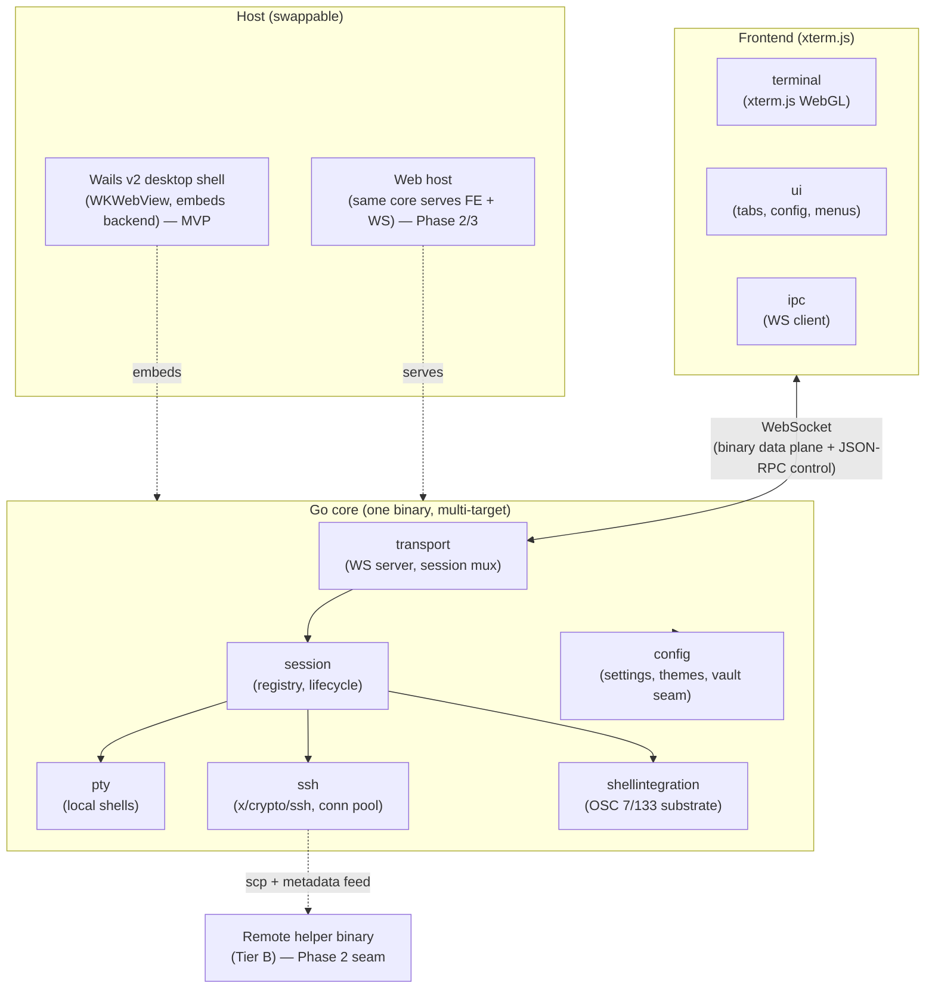

# nocx — High-Level Architecture

## Overview

nocx is a local-first terminal that pairs a Ghostty-grade rendering engine with Tabby-style SSH ergonomics, delivered as a macOS desktop app for MVP. It is built as **one Go core** (PTY, SSH, session, config) decoupled over a WebSocket transport from an **xterm.js** (WebGL) frontend ([ADR-0001](decisions/0001-xterm-js-as-vt-frontend.md); wterm remains switchable behind the renderer interface), hosted by a **Wails v2** desktop shell that embeds the backend locally. The paradigm is **modular, layered, interface-first with dependency injection**: every module lives behind an interface, depends on abstractions, obeys SRP, and is wired at a single composition root — so any module is trivially replaceable and the same core can later serve a web target and a remote helper from additional build outputs.

## Component Diagram

## Data Flow

```mermaid
graph LR
    key["Keystroke<br/>(xterm.js)"] --> ipcout["ipc: WS binary frame"]
    ipcout --> tp["transport:<br/>route by session-id"]
    tp --> sess["session goroutine"]
    sess --> io{"local or remote?"}
    io -->|local| ptyw["pty: write to PTY"]
    io -->|remote| sshw["ssh: write to channel"]
    ptyw --> outbytes["output bytes"]
    sshw --> outbytes
    outbytes --> tpb["transport: WS binary frame"]
    tpb --> render["xterm.js: parse VT + render grid"]

    render --> osc["frontend surfaces<br/>OSC 7 / OSC 133 (verified)"]
    osc --> ev["terminal→ui event (frontend-side ONLY):<br/>cwd {host, path} · marker {A|B|C|D, exitCode?}"]
    ev --> app["ui / app layer"]
    app --> act["actions: copy-folder-path,<br/>duplicate-tab-in-cwd<br/>(routes on originating session)"]
    app -.->|"feeds open{cwd}"| newtab["ipc: open{...} JSON<br/>(new / duplicated tab)"]
    newtab -.-> tp
```

cwd/prompt markers never cross the WS as their own control messages — they are consumed frontend-side to drive UI actions and to populate the `open{cwd}` of the next tab (see AD-1, AD-6).

## Module Map

**Backend (Go core)** — one interface, one responsibility each:

| Module | SRP responsibility |
| --- | --- |
| `pty` | Spawn and manage local pseudo-terminals; stream their I/O. |
| `ssh` | Establish and manage SSH connections/channels via `x/crypto/ssh`, honoring `~/.ssh/config`; own a **ref-counted `ssh.Client` connection pool** keyed by host+identity (channels multiplex over one connection). |
| `session` | Own session lifecycle; act as the registry mapping session-id → one PTY/SSH channel + one goroutine. Owns the **channel**; references (never owns) a pooled `ssh` connection. |
| `transport` | Serve one WebSocket per client; multiplex sessions; carry the binary data plane (PTY I/O) and the JSON-RPC control plane; enforce reconnect replay (AD-9) and backpressure (AD-10). |
| `config` | Load/persist settings, themes, keybindings, tab-restore; house the Phase-2 vault seam. |
| `shellintegration` | Provide the OSC 7/133 substrate contract (Tier A shell hooks now; Tier B remote-helper seam later). |

**Frontend (xterm.js)**:

| Module | SRP responsibility |
| --- | --- |
| `terminal` | Own terminal render state (grid, scrollback, selection); parse VT and surface OSC events via `parser.registerOscHandler` (verified — [ADR-0001](decisions/0001-xterm-js-as-vt-frontend.md)). |
| `ui` | Render tabs, menus, config, and map OSC/cwd events to user actions. |
| `ipc` | Speak the WebSocket protocol: binary data plane (PTY I/O) + JSON-RPC control plane; ack received byte-offsets (AD-9). |

## Architectural Decisions

All decisions below are **[ADOPTED]**. Each carries stable IDs; do not re-litigate.

**AD-1 — Decouple frontend/backend over a WebSocket transport.**
- Binds: all frontend↔backend communication.
- Prevents: shell-locked IPC that blocks a future web version; and a heavyweight transport abstraction (e.g. socket.io) whose unbounded buffering fights AD-10 backpressure and whose Go server ports lag the protocol.
- Rule: one WebSocket per client, split into two planes; sessions multiplexed by server-assigned session-id. Wire format is explicit:
  - **Data plane** (PTY I/O) = raw **binary** frames: `1-byte version || 1-byte msg-type || 16-byte session-id || payload`. PTY bytes are **never** wrapped in JSON/JSON-RPC — base64 + parse overhead would dent the hero rendering perf.
  - **Control plane** = **JSON-RPC 2.0** over text frames: `open`, `close`, `resize`, acks, and connection management as JSON-RPC requests & notifications; the server returns the authoritative `sessionId` in the `open` result (see AD-7). Chosen over socket.io — proven LSP/gopls precedent, agent-familiar, no buffering/abstraction fighting AD-10.
  - cwd/OSC/prompt markers do **not** cross the control plane — they stay frontend-side (see AD-6, Data Flow) and only feed UI + the next `open{cwd}`.
  - **Resize contract**: `open` MUST carry initial `{cols, rows, xpixel, ypixel}`; `resize` carries the same shape; the PTY/SSH channel is created at that size — **never spawned-then-resized** (avoids the reflow flash that dents the rendering promise).
  - **Forward-compat**: the version byte AND a reserved `metadata` msg-type are allocated now, so the Phase-2 Tier-B helper feed can ship without a wire break.
  - Security invariant for when web ships: auth token + bind-to-localhost by default.

**AD-2 — Go backend service as the one core.**
- Binds: PTY, SSH, session, config, shell-integration logic.
- Prevents: language fork between desktop and web; logic duplicated per host.
- Rule: one Go codebase produces multiple build targets (desktop backend, web server, remote helper); hosts embed or serve it, never reimplement it.

**AD-3 — Wails v2 as the MVP desktop shell.**
- Binds: desktop packaging and the embedded WebView (WKWebView on macOS).
- Prevents: premature adoption of Wails v3 alpha; multi-window complexity MVP does not need.
- Rule: shell stays a thin, swappable host; tabs and Phase-2 splits are in-window. Migrate to v3 only if multi-window is required.

**AD-4 — SSH built on `golang.org/x/crypto/ssh` (foundation-first).**
- Binds: all SSH connection handling.
- Prevents: a spawn-`ssh` MVP that would need rewriting for the Phase-2 vault/profiles.
- Rule: SSH sits behind a clean interface; honor `~/.ssh/config` via a config parser (e.g. `kevinburke/ssh_config`); SFTP via `pkg/sftp` later; the vault injects credentials through this library. The `ssh` module owns a **ref-counted `ssh.Client` connection pool** keyed by host+identity: channels multiplex over one connection, and the connection closes with the last tab that references it — preserving connection reuse and Phase-2 vault credential caching.

**AD-5 — Two-tier shell-integration substrate.**
- Binds: cwd/prompt/block metadata and the features that consume it.
- Prevents: coupling MVP features to a remote-install requirement.
- Rule: Tier A = OSC 7/133 markers via shell hooks (zero remote install; local + over SSH) is the MVP substrate; Tier B = a cross-compiled Go helper scp'd to a remote host **augments** (never replaces) the remote shell and feeds richer metadata to the local terminal — a designed seam, not built now.
  - The OSC-7 cwd event payload = `{host, path}` (percent-decoded). Ownership: the **backend** owns "local vs remote + host" and validates the host; the frontend only supplies the desired path.
  - Fallback: when the shell emits no OSC 7, cwd falls back to `$HOME` — **surfaced to the user, not applied silently.**
  - Tier A relies on the VT frontend surfacing OSC 7/133 as events — **verified on xterm.js** (`nocx-dej`, [ADR-0001](decisions/0001-xterm-js-as-vt-frontend.md)).

**AD-6 — Single-owner state ownership.**
- Binds: where terminal vs. session state lives.
- Prevents: dual-ownership drift and byte-stream sniffing in the backend.
- Rule: the VT frontend (xterm.js — [ADR-0001](decisions/0001-xterm-js-as-vt-frontend.md)) owns render state (grid, scrollback, selection) and parses OSC 7/133, surfacing them as events via `parser.registerOscHandler` (verified, `nocx-dej`); the Go backend owns PTY/session lifecycle, SSH connections, and config/vault. The backend does **not** sniff the byte stream.
  - ~~Conditional dependency~~ **DISCHARGED** ([ADR-0001](decisions/0001-xterm-js-as-vt-frontend.md)): the VT frontend is xterm.js, whose `parser.registerOscHandler` was verified to deliver OSC 7 and OSC 133 frontend-side. The backend never parses OSC.

**AD-7 — Session model: one PTY/channel per tab.**
- Binds: concurrency and session bookkeeping.
- Prevents: shared-goroutine coupling across tabs.
- Rule: one PTY (or SSH channel) per tab; one goroutine per session; the backend `session` module is the authoritative registry keyed by session-id.
  - **Session-id authority is server-authoritative.** The client sends `open{correlationId, ...}`; the server assigns and returns the authoritative `sessionId` in an ack; the client MUST NOT send PTY frames for a session before its ack.
  - **Channel/connection ownership**: `session` owns the channel and references (does not own) a pooled `ssh` connection from AD-4. The shared `Channel` interface declares `Resize() error` (may return an unsupported error) and a `Disconnected` signal, so local-PTY and SSH both feed AD-9 reconnect uniformly.

**AD-8 — Interface-first + dependency injection paradigm.**
- Binds: every module boundary.
- Prevents: concrete-to-concrete coupling that blocks swapping and testing.
- Rule: every module lives behind an interface and obeys SRP; wiring happens via **manual constructor injection at a single composition root** — the default. `google/wire` was archived read-only (2025-08-25); treat any compile-time DI tool as an optional codegen convenience only [ASSUMPTION]. This same seam is the future plugin seam — a plugin is just another implementation registered at the composition root.

**AD-9 — Reconnect / replay ownership.**
- Binds: session + transport + ipc + terminal.
- Prevents: data loss or corrupt render on a dropped WS; scrollback dual-ownership.
- Rule: the backend holds a **bounded per-session output ring** keyed by a monotonic byte-offset; the frontend acks the last-received offset. On reconnect the frontend sends its last offset and the backend replays from there, or emits an explicit `reset` (clear + resync) if the offset is past the buffer.
  - This replay ring is **transport buffering, not scrollback ownership** — scrollback stays frontend-owned, so AD-6 is intact.

**AD-10 — Backpressure / flow-control.**
- Binds: transport + session + ipc + terminal.
- Prevents: OOM, dropped bytes, and cross-tab head-of-line stalls on the shared WS.
- Rule: bounded in-flight-byte **credit per session**; when the credit is exhausted, apply backpressure to the PTY/SSH read (throttle the source — **never drop, never grow unbounded**). Bytes are lossless and ordered; per-session fairness ensures one busy tab cannot starve others.

## Cross-Cutting Concerns

**DI / replaceability.** Modules depend only on abstractions; the composition root is the one place concrete implementations are chosen and wired. Swapping SSH backends, transports, or loggers is a one-line change at the root, and every module is independently testable via injected fakes.

**Quality gates & CI.** Enforced from commit #1: both Go and TypeScript are gated the same way — format, lint, and test. Go uses `golangci-lint` and `gofumpt`; the frontend is held to the same bar. The per-commit gate is the `.githooks/pre-commit` hook, mirrored by `make ci`; GitHub Actions validates release branches and tags only — a deliberate temporary choice (tracked in beads) to avoid burning macOS runner time on every PR before the MVP has something worth guarding. Tests are mandatory (TDD) for every language.

**Logging / observability.** Structured logging via Go `log/slog`, context-propagated, behind a swappable logging interface. Metrics and tracing seams are designed-for but not built (YAGNI). The frontend logs to the browser console and those logs are forwardable to the backend.

**Testing strategy.** TDD from the start; unit tests per module against interfaces with injected fakes; integration tests across the transport boundary (WS protocol contract, including AD-9 replay and AD-10 backpressure) and the session/PTY path. The frontend is a peer test surface: the `ipc` wire-protocol contract against Go framing (`internal/transport/frame.go`), the session lifecycle (`connect` → `open` → authoritative `sessionId`, AD-7), and renderer-facing behaviour. `tsc --noEmit` is the frontend's **static analysis** — not a test (a promise that never resolves type-checks perfectly). The per-commit gate is the pre-commit hook and `make ci`; GitHub Actions runs only for release branches and tags (deliberate temporary choice, tracked in beads).

**Governing principle.** Keep the architecture clean: no accumulated tech debt, no backward-compatibility constraints (greenfield — break and refactor freely), no dead code (delete aggressively), no quick-win hacks. YAGNI still applies — do not build speculative features.

## Operational / Environmental Envelope

- **Build & CI.** GitHub Actions builds, lints, formats, and tests every change; releases are produced by CI and shared with colleagues directly (no app store, no formal distribution). The single Go codebase cross-compiles to multiple targets: desktop backend, web server, and (Phase 2) the remote helper.
- **macOS packaging.** Wails v2 packages the desktop app (`.app` bundle) with the Go backend embedded and the frontend bundle served into WKWebView. MVP is macOS-only; Windows/Linux are Phase 3.
- **Config / data locations.** Plain files in the OS config dir — `~/Library/Application Support/nocx` on macOS. Settings/themes/keybindings as JSON or TOML [ASSUMPTION: exact format TBD]; tab-restore as a small session file. The Phase-2 vault is a separate encrypted, single-machine store with no sync.
- **Tab-restore ownership.** The restore record is assembled at persist time from backend-owned `{sessionId, kind, host}` plus a frontend-supplied `cwd` snapshot; `config` persists, the frontend supplies — one writer, defined inputs.
- **Web target deploy (later).** The same Go core runs as a network service serving the frontend bundle + WS. Security invariant: auth token + bind-to-localhost by default; exposure beyond localhost is an explicit, deliberate configuration.

## Deferred / Seams (Phase 2+)

- **Web version** — same core served over the network. Revisit when a non-macOS or remote-access need appears (Phase 2/3).
- **Secrets vault** — separate encrypted single-machine store, credentials injected through the SSH interface. Revisit at Phase 2 start.
- **Warpify Tier-B remote helper** — cross-compiled Go binary augmenting the remote shell, feeding the reserved `metadata` msg-type (AD-1). Revisit when Tier A cwd fidelity proves insufficient or richer remote metadata (file-tree) is wanted.
- **Splits / panes** — in-window layout above the session model. Revisit at Phase 2.
- **Scrollback search (find-in-output)** — frontend-owned over existing render state. Revisit at Phase 2.
- **Plugin API** — no runtime built now; the interface-first + DI + composition-root design already is the seam. Revisit only if third-party extension becomes a goal.

## Risks / Open Questions

- The VT-frontend OSC / API risk was resolved in
  [ADR-0001](docs/decisions/0001-xterm-js-as-vt-frontend.md).
- **Wails v2 vs v3.** v2 is stable and MVP-sufficient; v3 remains alpha. Open question: whether any Phase-2 feature (e.g. multi-window) forces an earlier v3 migration.
- **Config format** — JSON vs TOML for settings/themes/keybindings is unresolved. [ASSUMPTION: either; leaning JSON/TOML per module.]

### Assumptions to confirm

- [ASSUMPTION] `google/wire` was archived read-only (2025-08-25); manual constructor injection at the composition root is the default, and any compile-time DI tool is an optional convenience only.
- [ASSUMPTION] Persisted config format (JSON or TOML) not yet fixed.
- [ASSUMPTION] Frontend log forwarding to the backend is desired but its transport/verbosity is unspecified.
