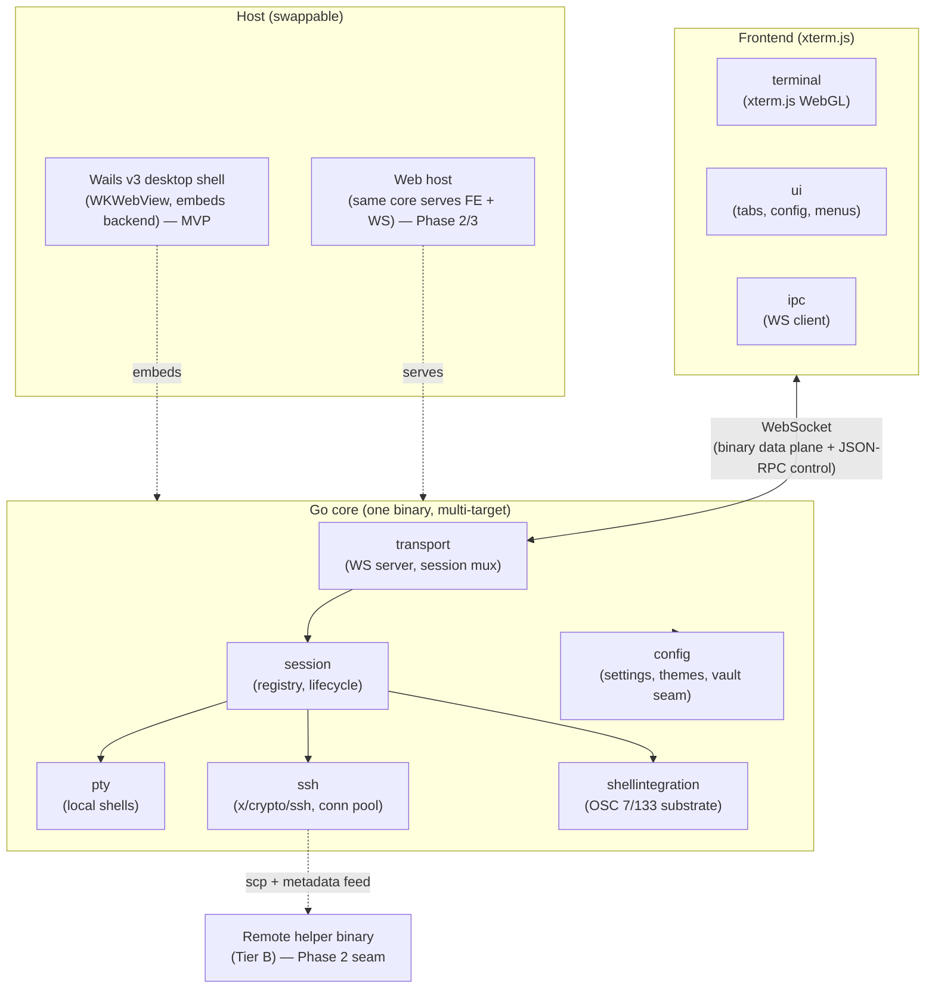

# nocx — High-Level Architecture

## Overview

nocx is a local-first terminal that pairs a Ghostty-grade rendering engine with Tabby-style SSH ergonomics, delivered as a macOS desktop app for MVP. It is built as **one Go core** (PTY, SSH, session, config) decoupled over a WebSocket transport from an **xterm.js** (WebGL) frontend ([ADR-0001](decisions/0001-xterm-js-as-vt-frontend.md)), hosted by a **Wails v3** desktop shell that embeds the backend locally. The paradigm is **modular, layered, interface-first with dependency injection**: every module lives behind an interface, depends on abstractions, obeys SRP, and is wired at a single composition root — so any module is trivially replaceable and the same core can later serve a web target and a remote…

## Component Diagram

```mermaid
graph TB
    subgraph host["Host (swappable)"]
        wails["Wails v3 desktop shell<br/>(WKWebView, embeds backend) — MVP"]
        webhost["Web host<br/>(same core serves FE + WS) — Phase 2/3"]
    end

    subgraph fe["Frontend (xterm.js)"]
        terminal["terminal<br/>(xterm.js WebGL)"]
        ui["ui<br/>(tabs, config, menus)"]
        ipc["ipc<br/>(WS client)"]
    end

    subgraph core["Go core (one binary, multi-target)"]
        transport["transport<br/>(WS server, session mux)"]
        session["session<br/>(registry, lifecycle)"]
        pty["pty<br/>(local shells)"]
        ssh["ssh<br/>(x/crypto/ssh, conn pool)"]
        config["config<br/>(settings, themes, vault seam)"]
        shellint["shellintegration<br/>(OSC 7/133 substrate)"]
    end

    remote["Remote helper binary<br/>(Tier B) — Phase 2 seam"]

    wails -.embeds.-> core
    webhost -.serves.-> core
    fe <-->|"WebSocket<br/>(binary data plane + JSON-RPC control)"| transport
    transport --> session
    session --> pty
    session --> ssh
    session --> shellint
    core --> config
    ssh -.->|"scp + metadata feed"| remote
```

## Data Flow

```mermaid
graph LR
    key["Keystroke<br/>(xterm.js)"] --> ipcout["ipc: WS binary frame"]
    ipcout --> tp["transport:<br/>route by session-id"]
    tp --> sess["session goroutine"]
    sess --> io{"local or remote?"}
    io -->|local| ptyw["pty: write to PTY"]
    io -->|remote| sshw["ssh: write to channel"]
    ptyw --> outbytes["output bytes"]
    sshw --> outbytes
    outbytes --> tpb["transport: WS binary frame"]
    tpb --> render["xterm.js: parse VT + render grid"]

    render --> osc["frontend surfaces<br/>OSC 7 / OSC 133 (verified)"]
    osc --> ev["terminal→ui event (frontend-side ONLY):<br/>cwd {host, path} · marker {A|B|C|D, exitCode?}"]
    ev --> app["ui / app layer"]
    app --> act["actions: copy-folder-path,<br/>duplicate-tab-in-cwd<br/>(routes on originating session)"]
    app -.->|"feeds open{cwd}"| newtab["ipc: open{...} JSON<br/>(new / duplicated tab)"]
    newtab -.-> tp
```

cwd/prompt markers never cross the WS as their own control messages — they are consumed frontend-side to drive UI actions and to populate the `open{cwd}` of the next tab (see AD-1, AD-6).

## Module Map

**Backend (Go core)** — one interface, one responsibility each:

| Module             | SRP responsibility                                                                                                                                                                                              |
| ------------------ | --------------------------------------------------------------------------------------------------------------------------------------------------------------------------------------------------------------- |
| `pty`              | Spawn and manage local pseudo-terminals; stream their I/O.                                                                                                                                                      |
| `ssh`              | Establish and manage SSH connections/channels via `x/crypto/ssh`, honoring `~/.ssh/config`; own a **ref-counted `ssh.Client` connection pool** keyed by host+identity (channels multiplex over one connection). |
| `session`          | Own session lifecycle; act as the registry mapping session-id → one PTY/SSH channel + one goroutine. Owns the **channel**; references (never owns) a pooled `ssh` connection.                                   |
| `transport`        | Serve one WebSocket per client; multiplex sessions; carry the binary data plane (PTY I/O) and the JSON-RPC control plane; enforce reconnect replay (AD-9) and backpressure (AD-10).                             |
| `config`           | Load/persist settings, themes, keybindings, tab-restore; house the Phase-2 vault seam.                                                                                                                          |
| `shellintegration` | Provide the OSC 7/133 substrate contract (Tier A shell hooks now; Tier B remote-helper seam later).                                                                                                             |

**Frontend (xterm.js)**:

| Module     | SRP responsibility                                                                                                                                                                                                               |
| ---------- | -------------------------------------------------------------------------------------------------------------------------------------------------------------------------------------------------------------------------------- |
| `terminal` | Own terminal render state (grid, scrollback, selection); parse VT and surface OSC events via `parser.registerOscHandler` (verified — [ADR-0001](decisions/0001-xterm-js-as-vt-frontend.md)).                                     |
| `ui`       | Render tabs, menus, config, and map OSC/cwd events to user actions. Built on **SolidJS** ([ADR-0012](decisions/0012-solidjs-as-the-application-ui-layer.md)); it creates an empty host for `terminal` and never renders into it. |
| `ipc`      | Speak the WebSocket protocol: binary data plane (PTY I/O) + JSON-RPC control plane; ack received byte-offsets (AD-9).                                                                                                            |

## Architectural Decisions

All decisions below are **[ADOPTED]**. Each carries stable IDs; do not re-litigate.

**AD-1 — Decouple frontend/backend over a WebSocket transport.**

- Binds: all frontend↔backend communication.
- Prevents: shell-locked IPC that blocks a future web version; and a heavyweight transport abstraction (e.g. socket.io) whose unbounded buffering fights AD-10 backpressure and whose Go server ports lag the protocol.
- Rule: one WebSocket per client, split into two planes; sessions multiplexed by server-assigned session-id. Wire format is explicit:
  - **Data plane** (PTY I/O) = raw **binary** frames: `1-byte version || 1-byte msg-type || 16-byte session-id || payload`. PTY bytes are **never** wrapped in JSON/JSON-RPC — base64 + parse overhead would dent the hero rendering perf.
  - **Control plane** = **JSON-RPC 2.0** over text frames: `open`, `close`, `resize`, acks, and connection management as JSON-RPC requests & notifications; the server returns the authoritative `sessionId` in the `open` result (see AD-7). Chosen over socket.io — proven LSP/gopls precedent, agent-familiar, no buffering/abstraction fighting AD-10.
  - cwd/OSC/prompt markers do **not** cross the control plane — they stay frontend-side (see AD-6, Data Flow) and only feed UI + the next `open{cwd}`.
  - **Ledger facts may cross the control plane; raw bytes may not** (amended 2026-08-02, nocx-m64b, nocx-rtg0.13). The renderer already owns the VT state derived from the byte stream (AD-6); from that state it derives typed facts about a completed command — the command line, its cwd, marker-derived trust, its exit status, its timestamps — and MAY send those over the control plane as explicit, schema-checked JSON-RPC records (e.g. `history.record`) after the fact. The test: the backend receives a value it could not have inferred from the stream, never a byte stream it must interpret — AD-6 survives verbatim, the backend stays byte-blind, and nothing here gives it the output. What remains forbidden, so this is not a general licence: raw PTY bytes are never wrapped in JSON (base64/escaped stream text stays out of the control plane), raw OSC/VT sequences never cross (the backend never parses them), and no frontend-derived fact may carry or reconstruct the output it was derived from (ADR-0008).
  - **Presentation requests may cross too** (amended 2026-08-14, ADR-0029, nocx-uz7f). The enumeration above is extended from facts about a completed command to **presentation requests**: a parsed, expressly registered terminal sequence by which a program asks nocx to present a message (OSC 9, OSC 777). The test above is unchanged and still governs. What this is not: a program may ask, and it never chooses where the message goes — ADR-0029 binds every such record with the destination, provenance, trust-class, secret-bearing-URL and retention rules, and no program-initiated effect may cross without them.
  - **Resize contract**: `open` MUST carry initial `{cols, rows, xpixel, ypixel}`; `resize` carries the same shape; the PTY/SSH channel is created at that size — **never spawned-then-resized** (avoids the reflow flash that dents the rendering promise).
  - **Forward-compat**: the version byte AND a reserved `metadata` msg-type are allocated now, so the Phase-2 Tier-B helper feed can ship without a wire break.
  - Security invariant for when web ships: auth token + bind-to-localhost by default.

**AD-2 — Go backend service as the one core.**

- Binds: PTY, SSH, session, config, shell-integration logic.
- Prevents: language fork between desktop and web; logic duplicated per host.
- Rule: one Go codebase produces multiple build targets (desktop backend, web server, remote helper); hosts embed or serve it, never reimplement it.

**AD-3 — Wails as the desktop shell, thin and swappable.**

- Binds: desktop packaging and the embedded WebView (WKWebView on macOS).
- Prevents: business logic migrating into the shell, where it cannot be reached by the web or remote targets.
- Rule: shell stays a thin, swappable host; tabs and splits are in-window.
- **Version: v3** since `8004fd72` (`nocx-mgbjx`). This AD previously named v2 and permitted a migration on one condition — "migrate to v3 only if multi-window is required" — and that condition fired: v2's runtime has no window-creation call at all, every function being `Window*` acting on the single window. The AD was followed, not overridden. The move cost two Go source files and their tests, because AD-1 had already made the backend a WebSocket server and left the shell showing a window and supplying three OS conveniences; the work was in the build pipeline, which v3 restructures entirely (`wails.json` gives way to generated build assets, and the release workflow assembles the macOS bundle itself where v2's CLI did it).

**AD-4 — SSH built on `golang.org/x/crypto/ssh` (foundation-first).**

- Binds: all SSH connection handling.
- Prevents: a spawn-`ssh` MVP that would need rewriting for the Phase-2 vault/profiles.
- Rule: SSH sits behind a clean interface; honor `~/.ssh/config` via a config parser (e.g. `kevinburke/ssh_config`); SFTP via `pkg/sftp` later; the vault injects credentials through this library. The `ssh` module owns a **ref-counted `ssh.Client` connection pool** keyed by host+identity: channels multiplex over one connection, and the connection closes with the last tab that references it — preserving connection reuse and Phase-2 vault credential caching.

**AD-5 — Two-tier shell-integration substrate.**

- Binds: cwd/prompt/block metadata and the features that consume it.
- Prevents: coupling MVP features to a remote-install requirement.
- Rule: Tier A = OSC 7/133 markers via shell hooks (zero remote install; local + over SSH) is the MVP substrate; Tier B = a cross-compiled Go helper scp'd to a remote host **augments** (never replaces) the remote shell and feeds richer metadata to the local terminal — a designed seam, not built now.
  - The OSC-7 cwd event payload = `{host, path}` (percent-decoded). Ownership: the **backend** owns "local vs remote + host" and validates the host; the frontend only supplies the desired path.
  - Fallback: when the shell emits no OSC 7, cwd falls back to `$HOME` — **surfaced to the user, not applied silently.**
  - Tier A relies on the VT frontend surfacing OSC 7/133 as events — **verified on xterm.js** (`nocx-dej`, [ADR-0001](decisions/0001-xterm-js-as-vt-frontend.md)).

**AD-6 — Single-owner state ownership.**

- Binds: where terminal vs. session state lives.
- Prevents: dual-ownership drift and byte-stream sniffing in the backend.
- Rule: the VT frontend (xterm.js — [ADR-0001](decisions/0001-xterm-js-as-vt-frontend.md)) owns render state (grid, scrollback, selection) and parses OSC 7/133, surfacing them as events via `parser.registerOscHandler` (verified, `nocx-dej`); the Go backend owns PTY/session lifecycle, SSH connections, and config/vault. The backend does **not** sniff the byte stream.
  - ~~Conditional dependency~~ **DISCHARGED** ([ADR-0001](decisions/0001-xterm-js-as-vt-frontend.md)): the VT frontend is xterm.js, whose `parser.registerOscHandler` was verified to deliver OSC 7 and OSC 133 frontend-side. The backend never parses OSC.
  - **One read, and it is a framing we wrote — not the byte stream's meaning** (amended 2026-08-20, `nocx-m8jwn`, [ADR-0024](decisions/0024-authenticated-shell-integration-channel.md) decision 1's second carve-out, the integration-delivery-carrier design §5.5). Before an integrated remote session has a shell, nocx's own bootstrap program — a loader the backend wrote and sent as the remote command, holding stdin and stdout on the PTY and nothing else — is the only thing on the far end of that stream. In that interval, and in no other, the backend MAY read a **closed set of fixed-prefix, length-framed tokens it defined itself**: the loader has taken the terminal and may be written to, stage-1 is loaded and may be handed its frame, and exactly one terminal outcome. The interval opens where nocx commits to the bootstrap on that session — for a connection nocx dials, before the exec request is written; for a wrapped typed `ssh`, when multiplex ownership is proven, so the user's own host-key and password prompts are never inside it — and closes at that one terminal outcome, after which the reader is closed and never reads that session again. Recognised tokens are consumed at the reader, ahead of the AD-9 replay ring, so offsets and replay stay consistent; every other byte of the window is forwarded unchanged. **The mechanism this AD exists to protect is untouched, and this is not a general licence:** the backend still parses no VT and no OSC, xterm.js still owns the grid and the OSC handlers, no render state is derived in the backend, and nothing read here creates, authenticates, completes, revokes or assigns status to a lifecycle attempt — that authority is the authenticated channel's (ADR-0024 decision 2) and stays there. What makes this safe is the **window**, never the prefix: inside it there is no shell, no user program and no user keystroke, so the only writer other than our own loader is a process that can already write the session's terminal and is therefore already in a position to read the same bytes; outside it there is no reader at all, so a captured token replays into nothing. A read that needs the stream to **mean** something — a marker, a prompt, a filename, a program's output, anything a user or a third party wrote — is refused by this bullet and not permitted by it.
  - **UI-layer corollary** ([ADR-0012](decisions/0012-solidjs-as-the-application-ui-layer.md)): the application UI runs on SolidJS, and the same single-owner rule draws the line inside the frontend. Solid creates an **empty** host element and the terminal adapter takes exclusive ownership of its descendants — Solid never renders children beneath it, never keys or remounts it during ordinary tab activation, and never expresses terminal render state as reactive state. State crosses that boundary only through explicit imperative methods (`setVisible`, `resize`, `focus`), plus `setTarget`, which hands the host element to the adapter **before** mount so visibility is meaningful from the first activation. ADR-0005's WebKitGTK refresh pump stays inside the terminal controller; framework effects must not drive terminal refreshes.
    - **Visibility is applied before anything measures geometry**, and that ordering is asserted, not assumed. Learned in `nocx-njrx.2`: an adapter that only learned its host inside `mount()` left the pane hidden through mount and the first `viewportChanged`, a hidden pane measures ~0 width in WebKit and non-zero in Chromium, and the settings surface silently rendered its narrow layout with no content column. 544 unit tests and every Chromium e2e spec were green. The repo already carried the same hazard from the other side (`tabs.test.ts`, "hidden tab is not sent a misleading zero rectangle") — an end-state assertion is not an ordering assertion.

**AD-7 — Session model: one PTY/channel per tab.**

- Binds: concurrency and session bookkeeping.
- Prevents: shared-goroutine coupling across tabs.
- Rule: one PTY (or SSH channel) per tab; one goroutine per session; the backend `session` module is the authoritative registry keyed by session-id.
  - **Session-id authority is server-authoritative.** The client sends `open{correlationId, ...}`; the server assigns and returns the authoritative `sessionId` in an ack; the client MUST NOT send PTY frames for a session before its ack.
  - **Channel/connection ownership**: `session` owns the channel and references (does not own) a pooled `ssh` connection from AD-4. The shared `Channel` interface declares `Resize() error` (may return an unsupported error) and a `Disconnected` signal, so local-PTY and SSH both feed AD-9 reconnect uniformly.

**AD-8 — Interface-first + dependency injection paradigm.**

- Binds: every module boundary.
- Prevents: concrete-to-concrete coupling that blocks swapping and testing.
- Rule: every module lives behind an interface and obeys SRP; wiring happens via **manual constructor injection at a single composition root** — the default. `google/wire` was archived read-only (2025-08-25); treat any compile-time DI tool as an optional codegen convenience only [ASSUMPTION]. This same seam is the future plugin seam — a plugin is just another implementation registered at the composition root.
  - **Variation is expressed by the interface, never by a fork inside an implementation.** No mode strings, flag parameters or type tests selecting between behaviours: if behaviour differs, that difference is a method the implementation overrides or a policy the caller supplies. The test is whether a new implementation can be added without editing a `switch` and without copying lines — the same property that makes this seam a plugin seam. Corollary of AD-6: one behaviour copied into every implementation has as many owners as there are copies, and the next implementation is the one that forgets it.

**AD-9 — Reconnect / replay ownership.**

- Binds: session + transport + ipc + terminal.
- Prevents: data loss or corrupt render on a dropped WS; scrollback dual-ownership.
- Rule: the backend holds a **bounded per-session output ring** keyed by a monotonic byte-offset; the frontend acks the last-received offset. On reconnect the frontend sends its last offset and the backend replays from there, or emits an explicit `reset` (clear + resync) if the offset is past the buffer.
  - This replay ring is **transport buffering, not scrollback ownership** — scrollback stays frontend-owned, so AD-6 is intact.

**AD-10 — Backpressure / flow-control.**

- Binds: transport + session + ipc + terminal.
- Prevents: OOM, dropped bytes, and cross-tab head-of-line stalls on the shared WS.
- Rule: bounded in-flight-byte **credit per session**; when the credit is exhausted, apply backpressure to the PTY/SSH read (throttle the source — **never drop, never grow unbounded**). Bytes are lossless and ordered; per-session fairness ensures one busy tab cannot starve others.

## Cross-Cutting Concerns

**DI / replaceability.** Modules depend only on abstractions; the composition root is the one place concrete implementations are chosen and wired. Swapping SSH backends, transports, or loggers is a one-line change at the root, and every module is independently testable via injected fakes.

**Quality gates & CI.** Enforced from commit #1: both Go and TypeScript are gated the same way — format, lint, and test. Go uses `golangci-lint` and `gofumpt`; the frontend is held to the same bar. The per-commit gate is the `.githooks/pre-commit` hook, mirrored by `make ci`; GitHub Actions (`ci.yml`) runs on every pull request to `main` and on manual dispatch, and is _called_ by `release.yml` on a version tag so a release gates on a green suite. The `pull_request` trigger is the mechanical enforcement of **no merge without green** on `main` (nocx-q36): the pre-commit hook and `make ci` give the identical checks as fast local feedback, but a hook is bypassable with `--no-verify` and `make hooks` is a per-clone step a fresh checkout may skip, so for anything arriving through a pull request CI is the gate that cannot be side-stepped. Be precise about the shape of that claim: there is deliberately **no `push: [main]` trigger**, so a direct push to `main` is ungated. Work reaches `main` through a pull request as a rule, and the owner keeps the exception for themselves — the trigger list is that policy written down, not an oversight to be closed. What protects a _release_ is separate and unconditional: `release.yml` calls `ci.yml` on the tagged commit, so the suite is green on the exact commit being shipped however it got to `main`. `ci.yml` no longer has its own tag trigger — with `release.yml` calling it, keeping one would run the whole suite twice per release. Tests are mandatory (TDD) for every language.

**Logging / observability.** Structured logging via Go `log/slog`, context-propagated, behind a swappable logging interface. Metrics and tracing seams are designed-for but not built (YAGNI). The frontend logs to the browser console and those logs are forwardable to the backend.

**Testing strategy.** TDD from the start; unit tests per module against interfaces with injected fakes; integration tests across the transport boundary (WS protocol contract, including AD-9 replay and AD-10 backpressure) and the session/PTY path. The frontend is a peer test surface: the `ipc` wire-protocol contract against Go framing (`internal/transport/frame.go`), the session lifecycle (`connect` → `open` → authoritative `sessionId`, AD-7), and renderer-facing behaviour. `tsc --noEmit` is the frontend's **static analysis** — not a test (a promise that never resolves type-checks perfectly). The per-commit gate is the pre-commit hook and `make ci`; GitHub Actions runs on pull requests to `main` and — via `release.yml` → `ci.yml` — version tags.

**Governing principle.** Keep the architecture clean: no accumulated tech debt, no backward-compatibility constraints (greenfield — break and refactor freely), no dead code (delete aggressively), no quick-win hacks. YAGNI still applies — do not build speculative features.

## Operational / Environmental Envelope

- **Build & CI.** GitHub Actions lints, formats, and tests every change. `release.yml` triggers on a version tag, calls `ci.yml` as its gate, then builds both platforms in parallel — `build-macos` (universal bundle) and `build-linux` (AppImage) — and publishes a GitHub Release carrying a `.dmg` (human install on macOS), a `.zip` (the macOS updater payload), an `.AppImage` (Linux install _and_ updater payload), and an ed25519-signed `manifest.json`. No app store and no publisher signature; the reasoning is in ADR-0003. The single Go codebase cross-compiles to multiple targets: desktop backend, web server, and (Phase 2) the remote helper.
- **A release is a tag, never a branch.** The version is the tag and nothing else: `validate` derives it as `${tag#v}`, and it reaches the binary through `-ldflags` (`internal/version`) and the macOS plist through a build-time `wails.json` patch. There is no `VERSION` file and no bump script — the number is chosen by a person at `git tag` time. The tag must be stable `vMAJOR.MINOR.PATCH` and must point at a commit reachable from `main`; `validate` refuses anything else. The `version` fields in `package.json` and `frontend/package.json` are npm metadata, are read by nothing, and are not the product version.
- **Signing is verified before it is trusted.** `sign` generates the manifest, signs it with `RELEASE_SIGNING_KEY`, and then checks that signature against the keyring compiled into the very build being released (`internal/update/keyring.go`) — because a signature only ever verified by the key that made it proves nothing. That job runs on a dry run too, so the key and the shipped keyring are proven to be a pair before a tag exists. Only `publish` is gated on the tag, and it is the only job holding `contents: write`.
- **macOS packaging.** Wails v3 packages the desktop app (`.app` bundle) with the Go backend embedded and the frontend bundle served into WKWebView. macOS and Linux ship now — Linux as an AppImage (linuxdeploy + GTK plugin) bundling the GTK/WebKitGTK stack into one self-replaceable file (ADR-0007); Windows is Phase 3.
- **Config / data locations.** Plain files in the OS config dir — `~/Library/Application Support/nocx` on macOS. Settings/themes/keybindings as JSON or TOML [ASSUMPTION: exact format TBD]; tab-restore as a small session file. The Phase-2 vault is a separate encrypted, single-machine store with no sync.
- **Development and release own separate profiles.** The directory name is chosen by the build, not by a caller: `-tags release` resolves `nocx`, and every other build resolves `nocx-dev` (`internal/storage/appdir.go`). So `wails dev`, `make dev-web` and the Playwright suite — which launches a backend of its own — cannot read or overwrite the documents an installed nocx owns. The tag is on the release side deliberately: forgetting it costs a developer an empty profile, never a user their data. This replaces nothing else; it is the safe default underneath the per-run state directory that parallel e2e workers will additionally need (nocx-ti8w).
- **Tab-restore ownership.** The restore record is assembled at persist time from backend-owned `{sessionId, kind, host}` plus a frontend-supplied `cwd` snapshot; `config` persists, the frontend supplies — one writer, defined inputs.
- **Web target deploy (later).** The same Go core runs as a network service serving the frontend bundle + WS. Security invariant: auth token + bind-to-localhost by default; exposure beyond localhost is an explicit, deliberate configuration.

## Deferred / Seams (Phase 2+)

- **Web version** — same core served over the network. Revisit when a non-macOS or remote-access need appears (Phase 2/3).
- **Secrets vault** — separate encrypted single-machine store, credentials injected through the SSH interface. Revisit at Phase 2 start.
- **Tier-B remote helper** — cross-compiled Go binary augmenting the remote shell, feeding the reserved `metadata` msg-type (AD-1). Revisit when Tier A cwd fidelity proves insufficient or richer remote metadata (file-tree) is wanted. **Not** what Warp calls warpify: warpify is Tier A shell hooks, which is `nocx-pu4` and is being built now. This entry used to carry that name, which invited a reader to defer the wrong thing — the helper binary is deferred; the shell integration is not.
- **Splits / panes** — in-window layout above the session model. Revisit at Phase 2.
- **Scrollback search (find-in-output)** — frontend-owned over existing render state. Revisit at Phase 2.
- **Plugin API** — no runtime built now; the interface-first + DI + composition-root design already is the seam. Revisit only if third-party extension becomes a goal.

## Risks / Open Questions

- The VT-frontend OSC / API risk was resolved in
  [ADR-0001](docs/decisions/0001-xterm-js-as-vt-frontend.md).
- ~~**Wails v2 vs v3.**~~ **Closed.** The open question was whether a Phase-2 feature would force an earlier v3 migration; multi-window did, and the shell moved in `8004fd72` (`nocx-mgbjx`). See AD-3.
- **Config format** — JSON vs TOML for settings/themes/keybindings is unresolved. [ASSUMPTION: either; leaning JSON/TOML per module.]

### Assumptions to confirm

- [ASSUMPTION] `google/wire` was archived read-only (2025-08-25); manual constructor injection at the composition root is the default, and any compile-time DI tool is an optional convenience only.
- [ASSUMPTION] Persisted config format (JSON or TOML) not yet fixed.
- [ASSUMPTION] Frontend log forwarding to the backend is desired but its transport/verbosity is unspecified.
