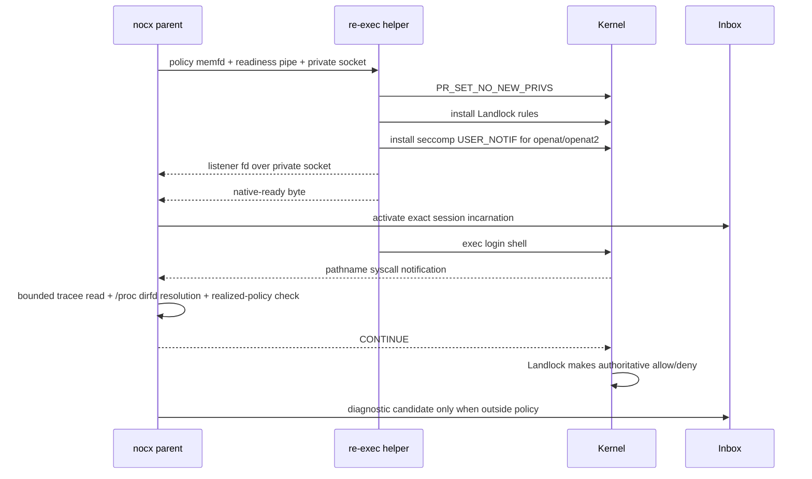

# Sandbox denied-access inbox — design

**Bead:** `nocx-091ij`
**Decision:** [ADR-0038](../../decisions/0038-sandbox-denied-access-inbox.md)
**Scope:** experimental local filesystem sandbox on Linux and macOS

## Product contract

Settings contains a separate **Developer → Sandbox access** page. It explains that the feed is best-effort and memory-only. A row represents one coalesced denied pathname attempt and shows:

- backend session id/incarnation;
- login shell;
- untrusted executable attribution;
- exact attempted path;
- exact directory proposed for a global rule, when safe;
- read-only or read/write intent;
- platform source, first/last time, count, and resolution state.

Every pending row exposes **Add global read-only**, **Add global read-write**, and **Dismiss**. Unsafe grants keep both add buttons visible but disabled with a reason. A read-only action on a write row remains enabled and carries the warning that it will not satisfy the write. Promotion affects future sandbox launches only; the current tab is neither widened nor retried.

## Backend ownership

`internal/sandbox.AccessInbox` is the sole event/state owner. It holds at most 500 rows and returns at most 200. Coalescing key:

```text
sessionId + instanceId + sessionEpoch + executable + path + accessClass
```

Rows and the global loss counter use monotonic process-local revisions. Eviction, malformed input, provisional overflow, and late delivery increment loss. The changed notification contains only `{revision}`.

`AccessSession` is the observer capability. The session registry mints its identity before PTY preparation; the platform service calls `BeginSession` with that identity. Up to 32 reports may wait provisionally. `Activate` runs only after the native readiness acknowledgement. `Close` discards provisional reports or expires active pending rows, then permanently refuses later delivery.

No observer parses PTY bytes, stderr, OSC, argv, environment, command text, or secrets.

## Linux flow



The seccomp BPF validates the audit architecture and kills on a mismatch. It returns `USER_NOTIF` only for `openat` and `openat2`; every other syscall returns `ALLOW`. The listener response is always `SECCOMP_USER_NOTIF_FLAG_CONTINUE`. This is observability, not enforcement.

Relative paths resolve through `/proc/<pid>/cwd` for `AT_FDCWD` and `/proc/<pid>/fd/<n>` otherwise. Tracee strings are capped at 16 KiB and must terminate. `O_PATH` is ignored. Write intent is any of `O_WRONLY`, `O_RDWR`, `O_CREAT`, `O_TRUNC`, or `O_APPEND`.

An unavailable listener marks the access monitor unavailable but does not undo Landlock or reject an otherwise enforced sandbox session.

Once a USER_NOTIF filter exists, its listener is an unavoidable synchronous dependency: an orphaned open blocks, and a closed listener returns `ENOSYS`. Therefore listener-descriptor handoff failure rejects that sandbox launch. An unexpected broker failure closes the listener, reports the monitor unavailable, and terminates only the affected sandbox fail-closed. This is not a policy decision—the filter still answers `CONTINUE` while healthy and Landlock remains authoritative—but it is an explicit Linux availability trade-off; there is no passive unprivileged whole-process denial feed.

## macOS flow

The backend generates `nocx-sandbox-<128-bit-hex>` and renders:

```scheme
(deny default (with message "nocx-sandbox-…"))
```

Before launch it starts the fixed binary `/usr/bin/log stream --style ndjson` with an `eventMessage CONTAINS` predicate containing only that backend token. Startup is accepted only if the process remains alive through the readiness window. Each NDJSON record is capped at 64 KiB; only token-matching absolute-path Seatbelt messages matching the closed `Sandbox: program(pid) deny ... file-* /path` grammar reach the per-session recorder. The monitor is cancelled before the recorder closes.

If unified-log access is unavailable, Seatbelt launch and enforcement remain unchanged and the Settings page reports observation unavailable.

## Safe grant root

The inbox derives a directory without widening:

1. If the attempted path currently identifies a directory, canonicalize exactly that directory.
2. Otherwise inspect only its immediate parent. If that parent is an existing directory, canonicalize it.
3. Otherwise, or if the result is the filesystem root, record the event with `canGrant=false`, an empty directory, and a user-facing reason.

It never climbs to a nearest existing ancestor. On resolve, `settings.Registry.AppendSandboxPath` canonicalizes again, validates the 32-entry limit and ADR-0036 cross-class rules, appends under the registry lock, persists, then publishes `settings.changed`. A failed append leaves the event pending. The transport returns a path-free typed refusal.

## Wire contract

| Method / notification    | Shape                                                              |
| ------------------------ | ------------------------------------------------------------------ |
| `sandbox.access.status`  | observer availability, platform/backend, reason/detail, loss count |
| `sandbox.access.list`    | bounded events, inbox revision, loss count                         |
| `sandbox.access.resolve` | request `{eventId, decision}`; result is the resolved event        |
| `sandbox.access.changed` | path-free `{revision}` invalidation                                |

The JSON schemas under `contracts/sandbox.access.*.schema.json` generate the renderer types. The frontend client does not construct event fields and never sends a path to `resolve`.

## Verification

- `go test ./internal/sandbox ./internal/settings ./internal/transport ./internal/session ./internal/app`
- `go test -race ./internal/sandbox ./internal/settings ./internal/transport`
- `GOOS=darwin GOARCH=amd64 go test -c ./internal/sandbox`
- `cd frontend && npm test -- --run sandbox-access-settings.test.tsx settings.test.ts ipc.test.ts`
- `cd frontend && npm run contracts:check && npm run typecheck`
- Linux smoke: `TestLinuxAccessMonitorReportsDeniedOpen` starts the real helper, applies real Landlock plus seccomp listener, runs `/bin/cat` against an outside file, and observes the read attempt without weakening the denial.
